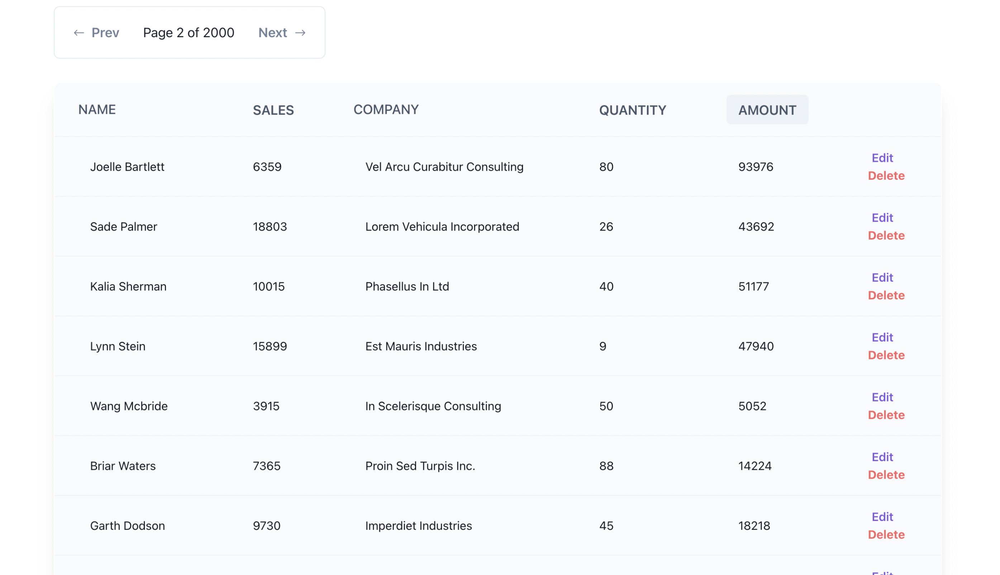

# Tabulated Data

This Application shows the implementation of table data which can handle 100,000 rows with pagination and support Sorting,Updating the user,Deleting the user

## Screenshots

## Features & Usage

- The frontend of this app is built using React and graphql
- The backend of this app is built using keystone and graphql

- You can change the page using the button on the page.
- You can change the number of rows you want to see in the table
- The Delete functionality didn't able to achieved complement because of cache managment issue in Apollo

## Setup

1. Clone this repository and access the project's directory.
2. In order to run Backend you can go to `cd backend` and run `yarn install` in order to seed the data you can run `yarn dev --seed-data`.
3. Run `yarn dev` to see the seeded data and run the server.
4. In order to run Frontend you can go to `cd frontend` and run `yarn install` .
5. You can run the app using `yarn start`

## Built With

- JavaScript/ES6

- React
- Apollo
- Graphql

- Chakra UI
- KeystoneJS
- [GeneratedData](https://github.com/benkeen/generatedata) to generate fake data

## Author

👤 **Shubham Singh**

- Github: [@shubhsk88](https://github.com/shubhsk88)
- Twitter: [@shubhski](twitter.com/shubski)
- Linkedin: [linkedin](https://www.linkedin.com/in/shubhski/)
